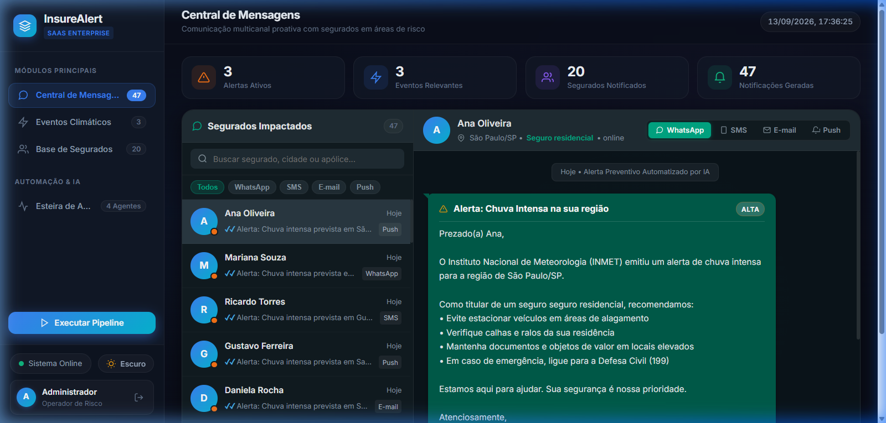
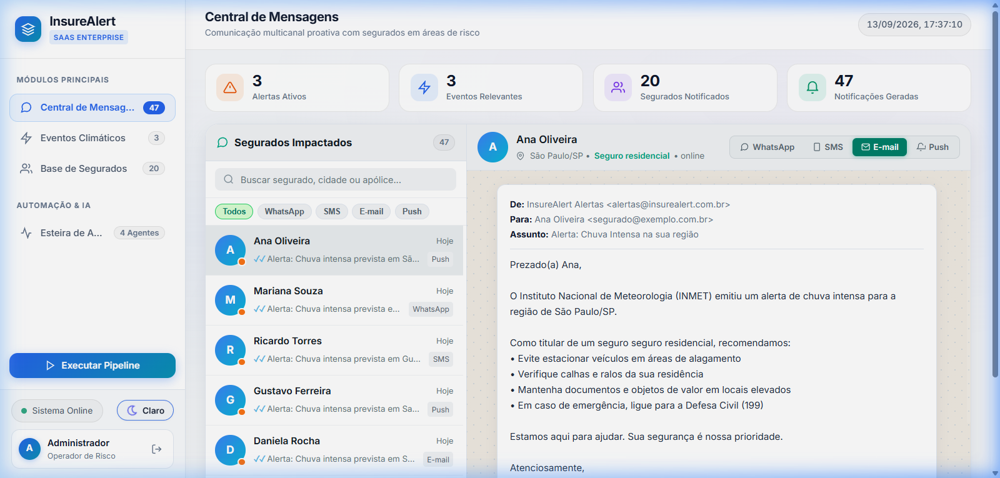
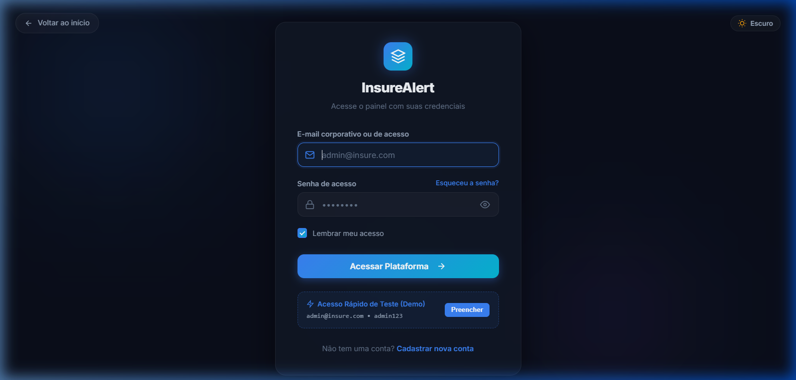
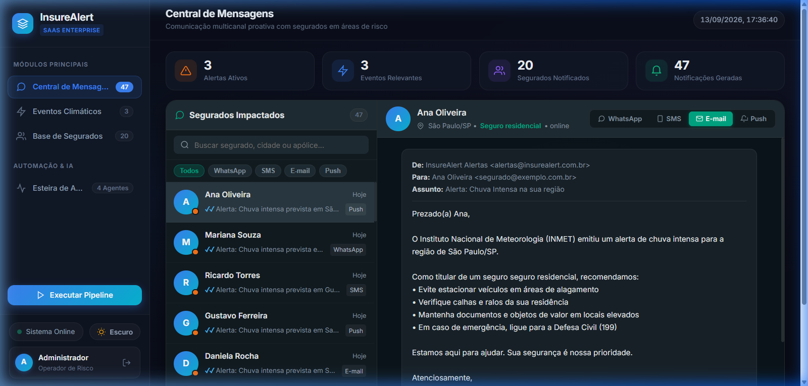
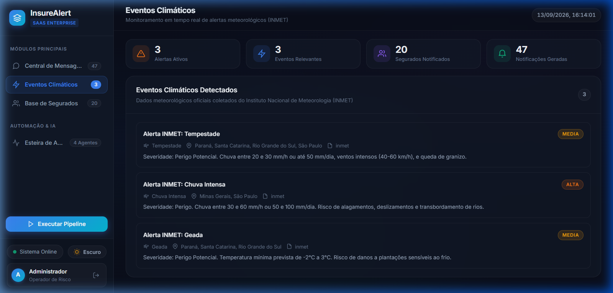
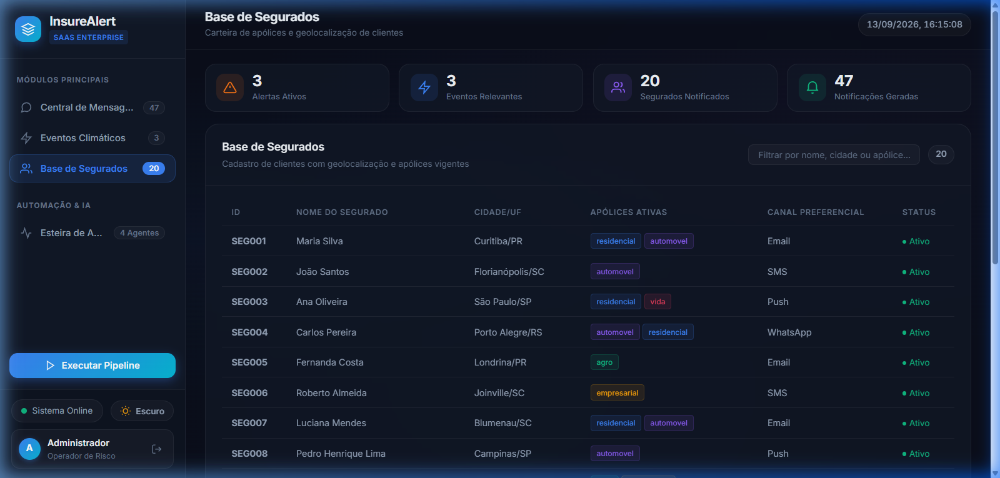
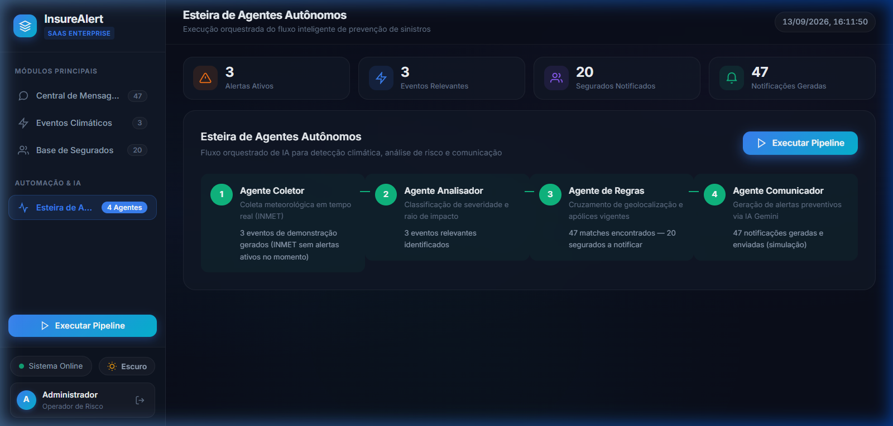
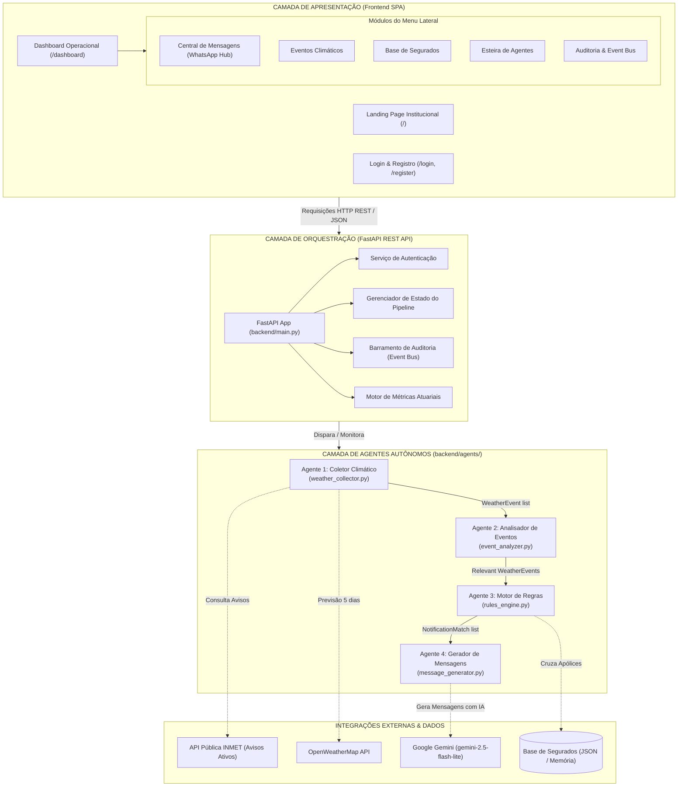
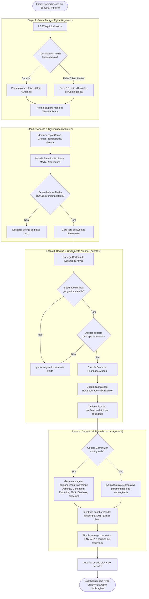

# InsureAlert — Ferramenta Inteligente para Comunicação Proativa com Segurados

> Sistema corporativo baseado em Inteligência Artificial para comunicação proativa com segurados, monitorando eventos climáticos em tempo real (INMET) e orquestrando alertas multicanal personalizados antes que sinistros ocorram.


---

## Sobre o Projeto

Este projeto foi desenvolvido como parte do **Desafio 5 — InsurMinds**, com o objetivo de criar uma solução baseada em **Inteligência Artificial** capaz de realizar comunicação proativa com segurados a partir da análise de eventos climáticos externos.

### O Problema
Historicamente, grande parte das interações entre seguradoras e segurados ocorre **apenas após** a ocorrência e consolidação do sinistro, gerando elevados custos operacionais de indenização e desgaste na experiência do cliente.

### A Solução
O **InsureAlert** transforma o modelo reativo em uma abordagem **preventiva e orientativa**, monitorando eventos climáticos em tempo real, cruzando dados geoespaciais com a carteira de apólices e enviando orientações claras de mitigação de danos através de canais prioritários (**WhatsApp, SMS, E-mail e Push**).

---

## Demonstração Visual das Telas

| Central de Mensagens (WhatsApp Web Hub - Dark) | Modo Claro Corporativo (Light Mode) |
| :---: | :---: |
|  |  |

| Tela de Login Corporativo Centralizada | Mockup de E-mail Institucional |
| :---: | :---: |
|  |  |

| Eventos Climáticos (INMET) | Base Cadastral de Segurados | Esteira dos 4 Agentes Autônomos |
| :---: | :---: | :---: |
|  |  |  |

---

## Arquitetura da Solução & Esteira Multi-Agente

A solução utiliza uma **arquitetura em camadas desacoplada** com uma esteira sequencial de **4 agentes autônomos especializados**:



---

## Fluxograma Procedural do Pipeline



---

## Funcionalidades Corporativas & Simulação de Cenário Real

Para refletir com fidelidade a operação real de seguradoras de grande porte (Porto Seguro, Allianz, Zurich, Tokio Marine), o **InsureAlert** foi expandido com módulos operacionais avançados:

1. **Gestão Cadastral Completa de Segurados (CRUD em Tempo Real)**:
   - Inclusão (`POST /api/policyholders`), consulta (`GET /api/policyholders`), edição (`PUT /api/policyholders/{id}`) e remoção (`DELETE /api/policyholders/{id}`) de clientes e apólices diretamente pelo modal do Dashboard, com persistência contínua em disco.
   - Suporte a múltiplos ramos com capitais segurados personalizados: Residencial, Automóvel, Rural e Empresarial.

2. **Respostas Rápidas Interativas no WhatsApp Hub (Mitigação Ativa de Sinistros)**:
   - Os segurados recebem botões interativos acionáveis no WhatsApp Hub:
     - `[Estou Seguro]`: Registra confirmação de segurança e encerra o fluxo sem necessidade de atendimento humano.
     - `[Acionar Guincho]`: Aciona socorro mecânico preventivo antes de alagamentos em vias públicas.
     - `[Acionar Vidraçaria]`: Pré-reserva reparo/troca de para-brisas em rede credenciada pós-granizo.
     - `[Solicitar Lona]`: Despacha equipe emergencial de fornecimento de lonas e amarração contra destelhamentos.
   - Toda solicitação gera automaticamente um **Protocolo Corporativo de Assistência** (ex: `PRT-2026-852E8A`) com SLA de atendimento e prestador credenciado designado.

3. **Painel de Impacto Atuarial & Redução de Sinistralidade (Loss Ratio)**:
   - Exibição no topo do Dashboard de métricas financeiras atuariais em tempo real (`GET /api/actuarial/metrics`):
     - **Capital sob Risco Imediato**: Soma das coberturas das apólices situadas nos municípios com alertas ativos do INMET.
     - **Sinistros Evitados (Estimativa Atuarial)**: Estimativa de sinistralidade prevenida pela adoção das medidas defensivas recomendadas pela IA.
     - **Custo do Disparo Omnicanal**: Custo de envio via WhatsApp Cloud API / SMPP SMS.
     - **ROI Preventivo**: Múltiplo financeiro de economia gerada para cada R$ 1,00 investido em comunicação preventiva.

4. **Barramento de Auditoria Distribuída (Event Bus / CloudEvents)**:
   - Console terminal de auditoria integrado (`GET /api/audit/stream`) simulando tópicos Kafka / Event Grid para conformidade e rastreabilidade total (LGPD e SUSEP).

---

## Stack Tecnológica

| Componente | Tecnologia | Papel |
|---|---|---|
| Backend | **FastAPI + Uvicorn** | API REST assíncrona de alta performance |
| Modelo de IA | **Google Gemini 2.0 Flash** | Síntese de comunicações empáticas e acionáveis |
| Coleta de Dados | **INMET API + OpenWeatherMap** | Monitoramento contínuo de dados meteorológicos |
| Validação | **Pydantic v2** | Tipagem e validação declarativa de contratos |
| Cliente HTTP | **HTTPX** | Requisições assíncronas com tratamento de timeouts |
| Frontend | **HTML5 / CSS3 / Vanilla JS** | SPA com Side Menu, WhatsApp Hub e Tema Dark/Light |

---

## Instalação e Execução

### 1. Clonar o Repositório
```bash
git clone https://github.com/jpscard/InsurMinds.git
cd InsurMinds/Desafio_5
```

### 2. Criar Ambiente Virtual e Instalar Dependências
```bash
python -m venv venv
venv\Scripts\activate      # Windows
# source venv/bin/activate # Linux / macOS
pip install -r requirements.txt
```

### 3. Configurar Variáveis de Ambiente (Opcional)
```bash
cp .env.example .env
# Configure GEMINI_API_KEY (opcional, fallback por templates ativo)
```

### 4. Iniciar o Servidor
```bash
python -m uvicorn backend.main:app --host 127.0.0.1 --port 8000 --reload
```

Acesse o sistema em: **http://localhost:8000** (ou **/login** com as credenciais de demonstração `admin@insure.com` / `admin123`).

---

## Estrutura de Diretórios

```
├── README.md                      # Documentação principal
├── relatorio_sistema.md           # Relatório técnico completo para avaliação
├── InsurMinds – Desafio 5.docx    # Relatório formal em formato Word DOCX
├── requirements.txt               # Dependências do projeto
├── docs/
│   └── images/                    # Screenshots oficiais em alta resolução
├── backend/
│   ├── main.py                    # Servidor FastAPI e rotas REST
│   ├── agents/                    # 4 Agentes autônomos (Coletor, Analisador, Regras, Mensagens)
│   ├── models/                    # Modelos de dados Pydantic
│   └── data/                      # Base de segurados cadastrada
└── frontend/
    ├── index.html                 # Landing Page institucional
    ├── login.html                 # Tela de Login corporativo centralizada
    ├── register.html              # Tela de Cadastro
    ├── dashboard.html             # Painel operacional com Side Menu
    ├── css/                       # Estilos globais, tema Claro/Escuro e animações
    └── js/                        # Lógica da interface e chamadas à API
```

---

## Deploy em Produção (Nuvem)

A aplicação está totalmente configurada e pronta para deploy em nuvem através de plataformas como **Render**, **Railway** ou **Docker**.

### Deploy no Render.com (Recomendado)
1. Crie uma conta gratuita em [render.com](https://render.com).
2. Clique em **New +** > **Web Service** e conecte o repositório GitHub (`jpscard/InsurMinds`).
3. Configure os parâmetros:
   - **Root Directory**: `Desafio_5`
   - **Environment**: `Python 3`
   - **Build Command**: `pip install -r requirements.txt`
   - **Start Command**: `uvicorn backend.main:app --host 0.0.0.0 --port $PORT`
4. *(Opcional)* Em **Environment Variables**, adicione a variável `GEMINI_API_KEY` com a sua chave do Google Gemini.
5. Clique em **Deploy Web Service**. O Render gerará uma URL pública segura (HTTPS) para teste imediato pela banca avaliadora.

### Deploy via Docker
```bash
docker build -t insurealert .
docker run -p 8000:8000 insurealert
```

---

## Licença

Este projeto está licenciado sob a licença **MIT** — consulte o arquivo [LICENSE](LICENSE) para mais detalhes.
