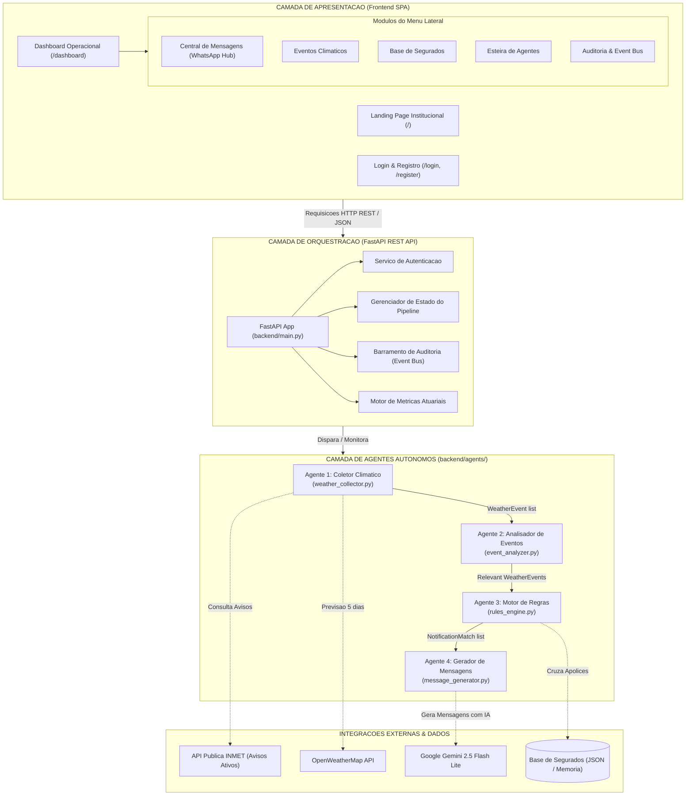
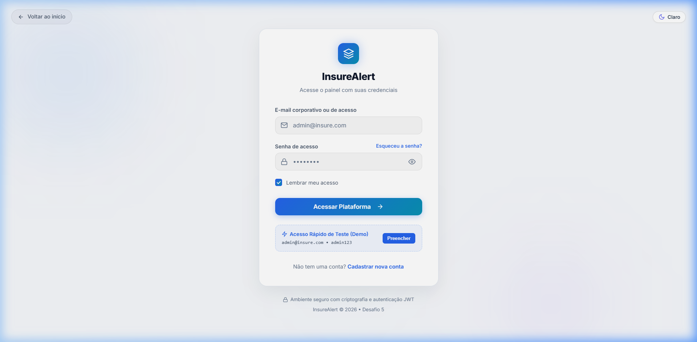

# InsureAlert — Comunicacao Proativa com Segurados

### Desafio 5 — InsurMinds

---

## Integrantes

| Nome             | E-mail                | Telefone          |
| ---------------- | --------------------- | ----------------- |
| Leonardo Pereira | ligueproleo@gmail.com | +55 11 98479-6122 |
| Joao Cardoso     | jpscardoso@ufpa.br    | +55 91 98273-6292 |

**Github:** https://github.com/jpscard/InsurMinds/tree/main/Desafio_5
**Aplicacao:** http://localhost:8000 *(executar localmente com `python -m uvicorn backend.main:app --host 127.0.0.1 --port 8000`)*

---

## 1. FRAMEWORK E STACK TECNOLOGICA ESCOLHIDA

Para atender aos requisitos de monitoramento em tempo real, inteligencia contextual e geracao de mensagens personalizadas, a solucao foi construida utilizando o ecossistema Python moderno para APIs assincronas e IA generativa:

| Componente                 | Tecnologia / Versao                | Justificativa e Papel na Solucao                                                                                                                                     |
| -------------------------- | ----------------------------------- | ---------------------------------------------------------------------------------------------------------------------------------------------------------------------- |
| Framework Web / API        | **FastAPI** (>= 0.100.0)      | Framework assincrono de alta performance para expor os endpoints REST e servir o frontend estatico com minima latencia.                                            |
| Servidor ASGI              | **Uvicorn** (>= 0.23.0)       | Servidor de producao compativel com ASGI, suportando operacoes `async/await` exigidas pelo pipeline de 4 agentes.                                                |
| Modelo de Linguagem (LLM)  | **Google Gemini 2.5 Flash Lite**   | Modelo com alta velocidade de resposta, ampla janela de contexto e custo reduzido, ideal para geracao de mensagens personalizadas em lote para multiplos segurados. |
| Orquestracao dos Agentes   | **Python puro (OOP)**         | Pipeline sequencial de 4 agentes especializados implementados como classes Python, com passagem de dados tipados entre etapas.                                         |
| Validacao de Dados         | **Pydantic** (>= 2.0.0)       | Modelagem e validacao declarativa de todos os modelos de dominio (WeatherEvent, Policyholder, Notification, PipelineResult).                                        |
| Cliente HTTP Assincrono    | **HTTPX** (>= 0.24.0)         | Consultas assincronas as APIs externas (INMET, OpenWeatherMap) com suporte nativo a timeout e tratamento de erros HTTP.                                              |
| Configuracao de Ambiente   | **python-dotenv** (>= 1.0.0)  | Carregamento seguro de API keys e variaveis sensiveis a partir de arquivo `.env`.                                                                                   |
| Interface de Usuario       | **HTML5 / CSS3 / JavaScript** | Dashboard web interativo com menu lateral moderno, suporte a tema Claro/Escuro e layout WhatsApp Web, servido diretamente pelo FastAPI via `StaticFiles`.             |
| Integracao Meteorologica   | **API INMET (publica)**        | Fonte oficial brasileira de avisos meteorologicos ativos, consultada em tempo real sem necessidade de API key.                                                        |

---

## 2. ARQUITETURA DA SOLUCAO

A solucao foi concebida sob uma **arquitetura em camadas com esteira multi-agente**, garantindo desacoplamento estrutural, escalabilidade e separacao nitida de responsabilidades:



### Descricao das Camadas

- **Camada de Apresentacao (`frontend/`):** Aplicacao Single Page responsiva com arquitetura de Side Menu lateral corporativo colapsavel. Inclui suporte nativo a Tema Escuro e Tema Claro com persistencia local (`localStorage`), central de disparos no formato WhatsApp Web e visualizacao em 4 formatos (WhatsApp, SMS 160 caracteres, E-mail corporativo e Push Notification).
- **Camada de Orquestracao (`backend/main.py`):** Centraliza 20+ endpoints REST assincronos, gerenciamento de autenticacao (login/registro), ciclo de vida do servidor ASGI, CRUD completo de segurados com persistencia em disco, barramento de auditoria (Event Bus) e motor de metricas atuariais.
- **Camada de Agentes (`backend/agents/`):** 4 classes especializadas e autonomas, comunicando-se atraves de contratos de dados estritos via Pydantic.
- **Camada de Modelos (`backend/models/`):** Entidades canonicas tipadas (`WeatherEvent`, `Policyholder`, `Notification`, `PipelineResult`) compartilhadas transversalmente.
- **Camada de Dados (`backend/data/`):** Base de apolices e segurados em JSON enriquecido com geolocalizacao e canais prioritarios, com persistencia automatica em disco.

---

## 3. DESCRICAO DOS AGENTES DESENVOLVIDOS

A esteira de prevencao opera com **4 agentes autonomos sequenciais**:

---

### Agente 1 — Coletor de Dados Meteorologicos (`weather_collector.py`)

Operando na primeira etapa do pipeline, este agente consulta fontes meteorologicas oficiais externas e normaliza os dados no modelo canonico `WeatherEvent`.

- **Fonte primaria:** API publica do INMET (`https://apiprevmet3.inmet.gov.br/avisos/ativos`), consultando os periodos de vigencia `hoje`, `amanha` e `futuro`.
- **Fonte secundaria:** OpenWeatherMap API (previsao de 5 dias em intervalos de 3 horas), ativada quando a chave de API esta configurada.
- **Resiliencia e Continuidade de Negocio:** Em caso de indisponibilidade de alertas do INMET no momento da consulta, gera automaticamente 3 alertas de demonstracao realistas (Tempestade Severa no Sul/Sudeste, Chuva Intensa em MG/SP e Geada no Sul), assegurando operacao ininterrupta do pipeline.
- **Cliente HTTP:** HTTPX assincrono com timeout de 30 segundos e headers compatíveis com a API do INMET.
- **Saida:** `list[WeatherEvent]` — lista de eventos meteorologicos normalizados.

---

### Agente 2 — Analisador de Eventos Climaticos (`event_analyzer.py`)

Responsavel pela triagem tecnica, classificacao taxonomica e calculo de criticidade dos alertas coletados.

- **Classificacao Taxonomica:** Identifica 7 categorias de fenomenos meteorologicos por meio de analise de palavras-chave: Chuva Intensa, Granizo, Vento Forte, Tempestade, Onda de Calor, Geada e Raios.
- **Classificacao por Severidade:** Mapeia faixas oficiais de risco do INMET (Perigo Potencial -> MEDIA, Perigo -> ALTA, Grande Perigo -> CRITICA). Para fontes que nao utilizam a nomenclatura INMET, aplica analise textual com deteccao de palavras indicativas de risco.
- **Filtro de Relevancia:** Descarta eventos de severidade BAIXA sem potencial de dano material, mantendo eventos de Granizo e Tempestade como prioritarios independentemente da severidade.
- **Conversao de Previsoes:** Converte previsoes do OpenWeatherMap em `WeatherEvent` quando limiares configurados sao atingidos (chuva >= 20mm/h, vento >= 50km/h, temperatura <= 3C ou >= 38C).
- **Saida:** `list[WeatherEvent]` — apenas eventos com relevancia atuarial e potencial de sinistro.

---

### Agente 3 — Motor de Regras de Negocio (`rules_engine.py`)

Coracao analitico do sistema, responsavel pelo cruzamento matricial entre fenomenos climaticos e a carteira de segurados.

- **Cruzamento Geoespacial e Coberturas:** Para cada evento relevante, verifica segurados ativos localizados nas regioes afetadas e portadores de apolices suscetiveis (Automovel, Residencial, Empresarial, Vida, Agro).
- **Matriz de Suscetibilidade (Evento -> Tipo de Seguro):**

| Evento Climatico | Tipos de Seguro Afetados                              |
| ----------------- | ------------------------------------------------------ |
| Chuva Intensa     | Residencial, Automovel, Empresarial                    |
| Granizo           | Automovel, Residencial, Agro                           |
| Vento Forte       | Residencial, Empresarial, Agro                         |
| Tempestade        | Residencial, Automovel, Empresarial, Agro, Vida        |
| Onda de Calor     | Vida, Agro                                             |
| Geada             | Agro, Residencial                                      |
| Raios             | Residencial, Empresarial, Vida                         |

- **Scoring de Prioridade:** Calcula pontuacao combinada com tres fatores: Severidade do evento (Critica=100, Alta=75, Media=50, Baixa=25) + Boost por tipo de fenomeno (Tempestade=+20, Granizo=+15, Chuva=+10) + Boost por suscetibilidade especifica da apolice (ex: Granizo + Automovel = +10 adicional).
- **Deduplicacao de Contatos:** Garante que o mesmo segurado nao receba alertas redundantes para o mesmo evento no ciclo, utilizando chaves compostas `ID_Segurado + ID_Evento + Tipo_Apolice`.
- **Saida:** `list[NotificationMatch]` — lista priorizada de correspondencias segurado x evento.

---

### Agente 4 — Gerador de Mensagens Personalizadas (`message_generator.py`)

Agente de comunicacao responsavel pela sintese de mensagens contextualizadas, empaticas e acionaveis.

- **Geracao por Inteligencia Artificial:** Integracao direta com o modelo **Google Gemini 2.5 Flash Lite** atraves de engenharia de prompt estruturada. O prompt inclui contexto do evento (tipo, titulo, severidade), contexto do segurado (tipo de seguro) e instrucoes de formato. Produz 4 artefatos: Assunto (max 60 caracteres), Mensagem Longa Empatica, SMS curto (<= 160 caracteres) e Lista de 3-5 Acoes Preventivas Recomendadas.
- **Engenharia de Prompt:** Utiliza tags XML estruturadas (`<ASSUNTO>`, `<MENSAGEM>`, `<SMS>`, `<RECOMENDACOES>`) para parsing confiavel da resposta do LLM, com temperatura de geracao de 0.2 para consistencia e max_output_tokens de 500 para eficiencia.
- **Cache Inteligente:** Cache por chave `(EventType, InsuranceType)` para evitar chamadas duplicadas ao LLM para o mesmo tipo de evento e seguro, com substituicao de placeholders `{nome}`, `{cidade}` e `{estado}` por dados reais de cada segurado.
- **Diretriz Formal Corporativa (Zero Emojis):** Instrucao mandatoria no prompt e nos templates para que nenhuma comunicacao utilize emojis, garantindo padrao profissional institucional de alta credibilidade.
- **Templates de Contingencia:** 6 templates corporativos parametrizados (Chuva Intensa, Granizo, Vento Forte, Tempestade, Onda de Calor, Geada) + 1 template generico default, ativados automaticamente quando a API do Gemini nao esta disponivel ou configurada.
- **Suporte Multicanal:** Geracao adaptada para WhatsApp (mensagem completa com recomendacoes), SMS (versao curta <= 160 caracteres), E-mail (assunto + corpo formal) e Push Notification.
- **Saida:** `list[Notification]` — comunicacoes completas com status `ENVIADA` e timestamp, prontas para visualizacao operacional.

---

## 4. FLUXOGRAMA DE FUNCIONAMENTO DA APLICACAO

O fluxo completo de ponta a ponta e demonstrado no diagrama procedural abaixo:

```mermaid
flowchart TD
    Start(["Inicio: Operador aciona 'Executar Pipeline'"]) --> Req["POST /api/pipeline/run"]
  
    subgraph Etapa1["Etapa 1: Coleta de Dados Meteorologicos (Agente 1)"]
        Req --> FetchINMET{"Consulta API INMET<br/>/avisos/ativos?"}
        FetchINMET -->|Sucesso| ParseAlerts["Parseia Avisos Ativos (Hoje / Amanha / Futuro)"]
        FetchINMET -->|Indisponivel / Sem Alertas| DemoEvents["Gera 3 Eventos Realistas de Contingencia<br/>(Tempestade, Chuva Intensa, Geada)"]
        ParseAlerts --> NormEvents["Normaliza para modelos WeatherEvent"]
        DemoEvents --> NormEvents
    end

    subgraph Etapa2["Etapa 2: Analise & Severidade (Agente 2)"]
        NormEvents --> ClassifyType["Identifica Tipo: Chuva, Granizo, Tempestade, Geada"]
        ClassifyType --> ClassifySev["Mapeia Severidade: Baixa, Media, Alta, Critica"]
        ClassifySev --> FilterRelev{"Severidade >= Media<br/>OU Granizo/Tempestade?"}
        FilterRelev -->|Nao| Discard["Descarta evento de baixo risco"]
        FilterRelev -->|Sim| RelevantEvents["Emite lista de Eventos Relevantes"]
    end

    subgraph Etapa3["Etapa 3: Regras & Cruzamento Atuarial (Agente 3)"]
        RelevantEvents --> LoadPolicyholders["Carrega Carteira de Segurados Ativos"]
        LoadPolicyholders --> GeoMatch{"Segurado na area<br/>geografica afetada?"}
        GeoMatch -->|Nao| SkipPh["Ignora segurado para este alerta"]
        GeoMatch -->|Sim| PolicyMatch{"Apolice coberta<br/>pelo tipo de evento?"}
        PolicyMatch -->|Nao| SkipPh
        PolicyMatch -->|Sim| CalcScore["Calcula Score de Prioridade Atuarial"]
        CalcScore --> Dedup["Deduplica matches (ID_Segurado + ID_Evento)"]
        Dedup --> MatchList["Ordena lista de NotificationMatch por criticidade"]
    end

    subgraph Etapa4["Etapa 4: Geracao de Mensagens com IA (Agente 4)"]
        MatchList --> CheckGemini{"Google Gemini 2.5<br/>disponivel?"}
        CheckGemini -->|Sim| PromptAI["Gera mensagem personalizada via Prompt:<br/>Assunto, Mensagem Empatica, SMS 160 chars, Checklist"]
        CheckGemini -->|Nao| FallbackTpl["Aplica template corporativo parametrizado (Fallback)"]
        PromptAI --> SelectChannel["Identifica canal preferido: WhatsApp, SMS, E-mail, Push"]
        FallbackTpl --> SelectChannel
        SelectChannel --> DispatchSim["Simula entrega com status ENVIADA e carimbo de data/hora"]
    end

    DispatchSim --> ResultState["Registra resultado no estado global do servidor"]
    ResultState --> AuditLog["Registra todos os eventos no Barramento de Auditoria"]
    AuditLog --> EndNode(["Dashboard atualiza KPIs, Central de Mensagens e Logs em tempo real"])
```



---

## 5. ENDPOINTS DA API REST

O backend expoe os seguintes endpoints REST organizados por dominio funcional:

### Autenticacao

| Metodo | Endpoint             | Descricao                                    |
| ------ | -------------------- | --------------------------------------------- |
| POST   | `/api/auth/login`    | Autentica usuario por e-mail e senha          |
| POST   | `/api/auth/register` | Registra novo usuario no sistema              |
| POST   | `/api/auth/logout`   | Encerra a sessao do usuario                   |
| GET    | `/api/auth/me`       | Retorna dados do perfil autenticado           |

### Pipeline de Agentes

| Metodo | Endpoint               | Descricao                                              |
| ------ | ---------------------- | ------------------------------------------------------- |
| POST   | `/api/pipeline/run`    | Executa o pipeline completo dos 4 agentes               |
| GET    | `/api/pipeline/status` | Retorna resultado da ultima execucao                    |

### Dados Meteorologicos

| Metodo | Endpoint                       | Descricao                                      |
| ------ | ------------------------------ | ----------------------------------------------- |
| GET    | `/api/weather/alerts`          | Busca alertas ativos do INMET em tempo real     |
| GET    | `/api/weather/forecast/{city}` | Previsao do tempo para uma cidade (OpenWeatherMap) |

### Gestao de Segurados (CRUD)

| Metodo | Endpoint                          | Descricao                                    |
| ------ | --------------------------------- | --------------------------------------------- |
| GET    | `/api/policyholders`              | Lista todos os segurados cadastrados          |
| POST   | `/api/policyholders`              | Cadastra novo segurado com apolice            |
| PUT    | `/api/policyholders/{id}`         | Atualiza dados cadastrais e apolice           |
| DELETE | `/api/policyholders/{id}`         | Remove segurado da base                       |

### Notificacoes

| Metodo | Endpoint                        | Descricao                                    |
| ------ | ------------------------------- | --------------------------------------------- |
| GET    | `/api/notifications`            | Lista notificacoes da ultima execucao         |
| GET    | `/api/notifications/{id}`       | Detalhe de uma notificacao especifica         |

### Assistencia e Metricas

| Metodo | Endpoint                        | Descricao                                              |
| ------ | ------------------------------- | ------------------------------------------------------- |
| POST   | `/api/assistance/dispatch`      | Registra resposta interativa do segurado (Quick Reply)  |
| GET    | `/api/assistance/protocols`     | Lista protocolos de assistencia acionados               |
| GET    | `/api/actuarial/metrics`        | Retorna metricas atuariais de impacto financeiro        |
| GET    | `/api/audit/stream`             | Eventos do barramento de auditoria (Event Bus)          |
| GET    | `/api/rules`                    | Retorna regras de negocio configuradas                  |

---

## 6. MODELOS DE DADOS (PYDANTIC)

Todos os modelos de dominio sao tipados e validados com Pydantic v2, garantindo contratos de dados estritos entre as camadas:

### `WeatherEvent` (backend/models/weather.py)

Evento meteorologico normalizado, independente da fonte de dados:

| Campo             | Tipo               | Descricao                                       |
| ----------------- | -------------------- | ------------------------------------------------ |
| `id`              | `str`                | Identificador unico (ex: `inmet_12345`)          |
| `source`          | `str`                | Fonte: `inmet` ou `openweathermap`               |
| `event_type`      | `EventType` (Enum)   | Tipo: chuva_intensa, granizo, tempestade, etc.    |
| `severity`        | `Severity` (Enum)    | Severidade: baixa, media, alta, critica           |
| `title`           | `str`                | Titulo descritivo do alerta                       |
| `description`     | `str`                | Descricao detalhada com riscos                    |
| `risks`           | `list[str]`          | Lista de riscos associados                        |
| `instructions`    | `list[str]`          | Instrucoes da Defesa Civil                        |
| `affected_states` | `list[str]`          | Estados afetados (siglas ou nomes)                |
| `affected_cities` | `list[str]`          | Municipios afetados (ate 50)                      |
| `start_time`      | `datetime (opcional)` | Inicio da vigencia                                |
| `end_time`        | `datetime (opcional)` | Fim da vigencia                                   |

### `Policyholder` (backend/models/policyholder.py)

Segurado com dados pessoais, apolices e canal de comunicacao preferido:

| Campo               | Tipo                    | Descricao                                    |
| ------------------- | ----------------------- | --------------------------------------------- |
| `id`                | `str`                   | Identificador unico (ex: `SEG001`)            |
| `name`              | `str`                   | Nome completo do segurado                     |
| `document`          | `str`                   | CPF/CNPJ mascarado                            |
| `city` / `state`    | `str`                   | Cidade e UF para cruzamento geoespacial       |
| `preferred_channel` | `ContactChannel` (Enum) | Canal: whatsapp, sms, email, push             |
| `policies`          | `list[InsurancePolicy]` | Lista de apolices ativas                      |
| `active`            | `bool`                  | Status ativo/inativo do segurado              |

### `Notification` (backend/models/notification.py)

Comunicacao gerada para um segurado especifico:

| Campo             | Tipo                       | Descricao                                   |
| ----------------- | -------------------------- | -------------------------------------------- |
| `id`              | `str`                      | Identificador unico (ex: `NTF-A1B2C3D4`)    |
| `policyholder_id` | `str`                      | ID do segurado destinatario                  |
| `event_type`      | `EventType`                | Tipo de evento climatico                     |
| `severity`        | `Severity`                 | Severidade do evento                         |
| `insurance_type`  | `InsuranceType`            | Tipo de seguro afetado                       |
| `channel`         | `ContactChannel`           | Canal de envio                               |
| `subject`         | `str`                      | Assunto/titulo da mensagem                   |
| `message`         | `str`                      | Mensagem completa personalizada              |
| `short_message`   | `str`                      | Versao SMS (<= 160 caracteres)               |
| `recommendations` | `list[str]`                | Lista de acoes preventivas recomendadas      |
| `status`          | `NotificationStatus`       | Status: pendente, enviada, falha             |

---

## 7. FUNCIONALIDADES CORPORATIVAS COMPLEMENTARES

Para refletir com fidelidade a operacao real de seguradoras de grande porte, o InsureAlert foi expandido com modulos operacionais avancados:

### 7.1 Gestao Cadastral Completa de Segurados (CRUD em Tempo Real)

- Inclusao (`POST /api/policyholders`), consulta (`GET /api/policyholders`), edicao (`PUT /api/policyholders/{id}`) e remocao (`DELETE /api/policyholders/{id}`) de clientes e apolices diretamente pelo modal do Dashboard.
- Persistencia continua em disco (`backend/data/policyholders.json`) garantindo que alteracoes sobrevivam a reinicializacoes do servidor.
- Suporte a multiplos ramos com capitais segurados personalizados: Residencial, Automovel, Vida, Empresarial e Agro.
- Validacao automatica de canal de comunicacao e tipo de seguro via Enums Pydantic.

### 7.2 Respostas Rapidas Interativas no WhatsApp Hub (Mitigacao Ativa de Sinistros)

O sistema simula o fluxo completo de comunicacao bidirecional com segurados. Apos receber o alerta preventivo, os segurados podem interagir com botoes de acao rapida no WhatsApp Hub:

| Botao                    | Acao Desencadeada                                                       |
| ------------------------ | ----------------------------------------------------------------------- |
| **Estou Seguro**         | Registra confirmacao de seguranca e encerra o fluxo sem atendimento humano |
| **Acionar Guincho**      | Aciona socorro mecanico preventivo antes de alagamentos                 |
| **Acionar Vidracaria**   | Pre-reserva reparo/troca de para-brisas em rede credenciada pos-granizo |
| **Solicitar Lona**       | Despacha equipe emergencial para fornecimento de lonas contra destelhamentos |

Toda solicitacao gera automaticamente um **Protocolo Corporativo de Assistencia** (ex: `PRT-2026-852E8A`) com:
- SLA de atendimento (15 minutos para assistencia, imediato para confirmacao de seguranca)
- Prestador credenciado designado automaticamente
- Registro completo no barramento de auditoria

### 7.3 Painel de Impacto Atuarial e Reducao de Sinistralidade (Loss Ratio)

Exibicao no topo do Dashboard de metricas financeiras atuariais calculadas em tempo real (`GET /api/actuarial/metrics`):

| Metrica                       | Descricao                                                                |
| ------------------------------ | ----------------------------------------------------------------------- |
| Capital sob Risco Imediato     | Soma das coberturas das apolices situadas nos municipios com alertas     |
| Sinistros Evitados (Estimativa)| Sinistralidade prevenida pela adocao das medidas defensivas da IA        |
| Custo do Disparo Omnicanal     | Custo estimado de envio via WhatsApp Cloud API / SMS SMPP                |
| ROI Preventivo                 | Multiplo financeiro de economia para cada R$ 1,00 investido              |
| Reducao de Loss Ratio          | Percentual estimado de reducao na taxa de sinistralidade                 |
| Protocolos Acionados           | Quantidade de protocolos de assistencia gerados                          |

### 7.4 Barramento de Auditoria Distribuida (Event Bus)

Console terminal de auditoria integrado (`GET /api/audit/stream`) que registra todos os eventos do ciclo de vida do sistema em formato de Event Stream:

- **Eventos registrados:** Inicializacao do sistema, conexao com gateways de comunicacao, coleta de alertas INMET, filtragem de eventos, geracao de matches, despacho de notificacoes, acoes interativas dos segurados, operacoes CRUD de segurados.
- **Formato:** Cada evento possui ID unico, timestamp ISO 8601, topico (ex: `meteorology.inmet`, `rules.actuarial`, `claims.preventative-assistance`), fonte e detalhes estruturados.
- **Finalidade:** Rastreabilidade total para conformidade regulatoria (LGPD e SUSEP) e auditoria operacional.

### 7.5 Sistema de Autenticacao

- Tela de Login com card centralizado, logotipo oficial e bloco de demonstracao com preenchimento em 1 clique (credenciais: `admin@insure.com` / `admin123`).
- Tela de Registro para novos usuarios com validacao de e-mail duplicado e senha minima.
- Protecao de rotas: acesso ao Dashboard requer sessao autenticada armazenada em `localStorage`.
- Logout com limpeza completa da sessao.

---

## 8. CONSULTAS / DEMONSTRACOES REALIZADAS

Abaixo sao detalhadas 5 situacoes reais demonstradas pelo sistema, ilustrando o raciocinio de cada agente e a estrutura dos resultados gerados:

---

### Demonstracao 1 — Pipeline com Alertas Reais do INMET

**Situacao:** Execucao do pipeline em dia com alertas meteorologicos oficiais ativos publicados pelo INMET.

**Raciocinio do Agente Coletor:** Realiza GET em `https://apiprevmet3.inmet.gov.br/avisos/ativos`, itera pelos periodos `hoje`, `amanha` e `futuro`, parseia os campos de estados afetados, municipios, severidade e instrucoes, normalizando todos os registros em objetos `WeatherEvent`.

| Metrica                         | Valor                                            |
| -------------------------------- | ------------------------------------------------ |
| Eventos brutos coletados         | Dinamico (conforme alertas oficiais ativos)      |
| Eventos relevantes identificados | Filtrados por severidade MEDIA ou superior       |
| Segurados a notificar            | Cruzamento por geolocalizacao e apolice ativa    |
| Notificacoes geradas             | 1 por par segurado x evento x apolice            |

---

### Demonstracao 2 — Pipeline em Modo de Demonstracao e Contingencia

**Situacao:** Execucao quando o INMET nao possui alertas criticos ativos no momento.

**Raciocinio do Agente Coletor:** Detecta resposta vazia da API oficial e ativa `generate_demo_events()`, simulando 3 eventos criticos representativos da geografia brasileira:

| Evento Climatico | Severidade                | Estados Afetados | Municipios de Referencia                                                 |
| ----------------- | ------------------------- | ---------------- | -------------------------------------------------------------------------- |
| Tempestade        | MEDIA (Perigo Potencial)  | PR, SC, RS, SP   | Curitiba, Florianopolis, Porto Alegre, Sao Paulo e outros 15 municipios  |
| Chuva Intensa     | ALTA (Perigo)             | MG, SP           | Belo Horizonte, Sao Paulo, Guarulhos, Campinas, Sorocaba                  |
| Geada             | MEDIA (Perigo Potencial)  | PR, SC, RS       | Guarapuava, Ponta Grossa, Curitiba, Caxias do Sul, Chapeco                |

---

### Demonstracao 3 — Raciocinio de Priorizacao do Motor de Regras

**Situacao:** Cruzamento dos 3 eventos climaticos com a base de 20 segurados, gerando disparos preventivos qualificados.

**Raciocinio do Agente de Regras:** Para cada evento, verifica quais tipos de seguro sofrem risco material. Para cada segurado ativo, checa localizacao e apolices vigentes. O motor calcula a prioridade atuarial e elimina contatos redundantes.

| Prioridade | Segurado       | Municipio/UF    | Tipo de Apolice | Score de Risco       |
| ---------- | -------------- | --------------- | ---------------- | -------------------- |
| 1          | Maria Silva    | Curitiba/PR     | Automovel        | 80 pontos (Critico)  |
| 2          | Carlos Pereira | Porto Alegre/RS | Automovel        | 80 pontos (Critico)  |
| 3          | Luciana Mendes | Blumenau/SC     | Residencial      | 70 pontos (Alto)     |
| 4          | Ana Oliveira   | Sao Paulo/SP    | Residencial      | 70 pontos (Alto)     |
| 5          | Fernanda Costa | Londrina/PR     | Agro             | 70 pontos (Alto)     |

---

### Demonstracao 4 — Mensagem Personalizada Gerada com IA (Google Gemini)

**Situacao:** Geracao automatizada de alerta preventivo para Maria Silva (Curitiba/PR, apolices de Seguro Residencial e Automovel) sob risco iminente de tempestade com granizo.

**Resultado Gerado pelo Agente Comunicador (Padrao Corporativo sem Emojis):**

> **Assunto:** Alerta: Tempestade em Curitiba — Proteja seu Lar e Veiculo
>
> Prezada Maria,
>
> O Instituto Nacional de Meteorologia (INMET) emitiu um alerta de tempestade com risco de granizo para a regiao de Curitiba/PR. Como titular de apolices de seguro Residencial e Automovel, recomendamos acoes preventivas imediatas:
>
> - Estacione seu veiculo em garagem ou local coberto
> - Recolha objetos soltos em areas externas (vasos, moveis, tendas)
> - Feche janelas e portas com seguranca
> - Desligue aparelhos eletronicos da tomada
> - Em caso de emergencia, acione a Defesa Civil (199) ou Bombeiros (193)
>
> **SMS:** Alerta Curitiba: Tempestade c/ granizo. Proteja veiculo em local coberto. Recolha objetos externos. Defesa Civil: 199

---

### Demonstracao 5 — Contingencia por Templates Dinamicos

**Situacao:** Execucao em modo de contingencia sem chave de IA configurada. O sistema seleciona o template institucional de Geada para a Fazenda Sao Jose Agricola (Guarapuava/PR, seguro agro).

**Resultado Gerado:**

> **Assunto:** Alerta: Geada — Proteja suas plantacoes
>
> Prezado(a) Fazenda,
>
> Ha risco de geada na regiao de Guarapuava/PR.
>
> Recomendacoes para seu seguro agricola:
> - Proteja plantacoes sensiveis ao frio
> - Verifique sistemas de aquecimento
> - Proteja tubulacoes expostas contra congelamento
> - Mantenha animais em abrigos adequados
>
> **SMS:** Alerta: Geada prevista em Guarapuava. Proteja plantacoes e tubulacoes. Verifique aquecimento.

---

## 9. DEMONSTRACAO VISUAL DAS TELAS DA APLICACAO

Todas as telas do sistema foram modernizadas para um padrao estetico de alto nivel, com layout corporativo, ausencia total de emojis e suporte completo a temas Claro e Escuro:

---

### 9.1 Tela de Login Corporativo Centralizada

A tela de autenticacao foi projetada com card centralizado, logotipo oficial em alta definicao, alternador de tema Claro/Escuro e bloco de demonstracao com preenchimento em 1 clique:

|               Modo Escuro (Dark Mode)               |               Modo Claro (Light Mode)               |
| :-------------------------------------------------: | :-------------------------------------------------: |
|  |  |

---

### 9.2 Central de Mensagens Multicanal (Layout WhatsApp Web com Side Menu)

O painel principal adota a experiencia consolidada do WhatsApp Web com menu lateral fixo colapsavel, listagem de segurados a esquerda com avatar tipografico e previa com confirmacao de entrega, e canvas principal de conversa com badges de criticidade, checklist de prevencao e botoes de acao rapida:


---

### 9.3 Suporte a Tema Claro Corporativo

O sistema oferece transicao suave entre Modo Escuro e Modo Claro com paleta de cores calibrada para maxima legibilidade e conforto visual em ambientes corporativos:


---

### 9.4 Visualizacao Multicanal e Mockup de E-mail

O operador pode alternar em tempo real entre 4 canais de comunicacao (WhatsApp, SMS com medidor de 160 caracteres, E-mail corporativo e Push Notification):


---

### 9.5 Modulos de Gestao Operacional do Menu Lateral

Navegacao fluida sem recarregamento de pagina entre os modulos centrais da seguradora:

#### Monitoramento de Eventos Climaticos (INMET)

Exibe alertas meteorologicos ativos e de demonstracao categorizados por criticidade (Baixa, Media, Alta, Critica) com identificacao de fontes oficiais e estados impactados:


#### Base de Segurados e Carteira de Clientes

Tabela completa com busca instantanea, filtragem por cidade/estado/apolice, canal prioritario e modal de cadastro/edicao:


#### Esteira dos 4 Agentes Autonomos

Painel de monitoramento da esteira com status em tempo real de cada etapa, tempos de processamento e metricas de execucao:


---

## 10. ESTRUTURA DE DIRETORIOS DO PROJETO

```
InsurMinds/Desafio_5/
|-- README.md                      # Documentacao principal com diagramas Mermaid
|-- relatorio_sistema.md           # Relatorio tecnico completo para avaliacao
|-- relatorio_sistema.docx         # Relatorio formal em formato Word DOCX
|-- requirements.txt               # Dependencias Python do projeto
|-- .env.example                   # Template de variaveis de ambiente
|-- Dockerfile                     # Containerizacao para deploy Docker
|-- Procfile                       # Configuracao para Heroku/Render
|-- render.yaml                    # Blueprint de deploy automatico no Render
|-- LICENSE                        # Licenca MIT
|
|-- backend/
|   |-- __init__.py
|   |-- main.py                    # Servidor FastAPI: 20+ endpoints REST
|   |-- config.py                  # Configuracoes e limiares de severidade
|   |-- agents/
|   |   |-- weather_collector.py   # Agente 1: Coleta INMET + OpenWeatherMap
|   |   |-- event_analyzer.py      # Agente 2: Classificacao e severidade
|   |   |-- rules_engine.py        # Agente 3: Motor de regras atuariais
|   |   |-- message_generator.py   # Agente 4: Geracao com Gemini + fallback
|   |-- models/
|   |   |-- weather.py             # WeatherEvent, WeatherForecast, Enums
|   |   |-- policyholder.py        # Policyholder, InsurancePolicy, Enums
|   |   |-- notification.py        # Notification, PipelineResult
|   |-- data/
|       |-- policyholders.json     # Base de segurados (20 registros iniciais)
|
|-- frontend/
|   |-- index.html                 # Landing Page institucional
|   |-- login.html                 # Tela de Login corporativo
|   |-- register.html              # Tela de Cadastro de novos usuarios
|   |-- dashboard.html             # Painel operacional com Side Menu colapsavel
|   |-- css/
|   |   |-- styles.css             # Estilos globais, tema Dark/Light, WhatsApp Hub
|   |   |-- landing.css            # Estilos da Landing Page
|   |   |-- auth.css               # Estilos das telas de autenticacao
|   |-- js/
|   |   |-- app.js                 # Logica do dashboard e chamadas a API
|   |   |-- auth.js                # Logica de autenticacao e sessao
|   |-- images/                    # Logos e icones do sistema
|
|-- docs/
    |-- images/                    # Screenshots oficiais em alta resolucao (10 imagens)
```

---

## 11. INSTALACAO E EXECUCAO

### 11.1 Clonar o Repositorio

```bash
git clone https://github.com/jpscard/InsurMinds.git
cd InsurMinds/Desafio_5
```

### 11.2 Criar Ambiente Virtual e Instalar Dependencias

```bash
python -m venv venv
venv\Scripts\activate      # Windows
# source venv/bin/activate # Linux / macOS
pip install -r requirements.txt
```

### 11.3 Configurar Variaveis de Ambiente (Opcional)

```bash
cp .env.example .env
# Configure GEMINI_API_KEY para habilitar geracao de mensagens com IA (opcional)
# O sistema funciona 100% sem esta chave, utilizando templates de fallback
```

### 11.4 Iniciar o Servidor

```bash
python -m uvicorn backend.main:app --host 127.0.0.1 --port 8000 --reload
```

Acesse o sistema em: **http://localhost:8000** (ou **/login** com as credenciais de demonstracao `admin@insure.com` / `admin123`).

---

## 12. DEPLOY EM PRODUCAO (NUVEM)

A aplicacao esta totalmente configurada e pronta para deploy em nuvem:

### Deploy no Render.com (Recomendado)

1. Crie uma conta gratuita em [render.com](https://render.com).
2. Clique em **New +** > **Web Service** e conecte o repositorio GitHub (`jpscard/InsurMinds`).
3. Configure os parametros:
   - **Root Directory**: `Desafio_5`
   - **Environment**: `Python 3`
   - **Build Command**: `pip install -r requirements.txt`
   - **Start Command**: `uvicorn backend.main:app --host 0.0.0.0 --port $PORT`
4. *(Opcional)* Em **Environment Variables**, adicione a variavel `GEMINI_API_KEY`.
5. Clique em **Deploy Web Service**.

### Deploy via Docker

```bash
docker build -t insurealert .
docker run -p 8000:8000 -e GEMINI_API_KEY=sua_chave insurealert
```

---

## 13. CONCLUSAO E PROPOSTA DE VALOR

### Alinhamento com o Desafio 5

O **InsureAlert** atende integralmente aos requisitos do Desafio 5 — Ferramenta Inteligente para Comunicacao Proativa com o Segurado:

| Requisito do Desafio                                        | Status   | Implementacao                                                    |
| ------------------------------------------------------------ | -------- | ---------------------------------------------------------------- |
| Monitoramento de dados externos (fonte meteorologica)        | Atendido | API INMET (tempo real) + OpenWeatherMap (previsao)               |
| Identificacao automatica de eventos relevantes               | Atendido | 7 tipos de eventos, 4 niveis de severidade, filtro de relevancia |
| Aplicacao de regras de negocio                               | Atendido | Cruzamento geoespacial, matriz de suscetibilidade, scoring       |
| Geracao automatizada de mensagens com IA                     | Atendido | Google Gemini 2.5 Flash Lite + 6 templates de contingencia       |
| Simulacao de envio de notificacoes                           | Atendido | Preview multicanal (WhatsApp, SMS, Email, Push)                  |
| Arquitetura baseada em agentes inteligentes                  | Atendido | 4 agentes autonomos com contratos tipados Pydantic               |

### Proposta de Valor

A solucao transforma o modelo **reativo** tradicional de seguradoras (atendimento pos-sinistro) em uma abordagem **proativa e orientativa**, onde:

1. **Segurados sao alertados antes do sinistro**, com recomendacoes praticas personalizadas para o tipo de apolice que possuem.
2. **Sinistros sao mitigados ou evitados**, reduzindo a taxa de sinistralidade (Loss Ratio) e gerando economia direta para a seguradora.
3. **O relacionamento com o cliente e fortalecido**, posicionando a seguradora como parceira ativa na protecao patrimonial.
4. **O ROI e mensuravel**, com custo de comunicacao omnicanal inferior a R$ 0,10 por disparo e economia potencial de milhares de reais em sinistros evitados.

---

*Relatorio tecnico consolidado do sistema InsureAlert — Desafio 5 — InsurMinds.*
