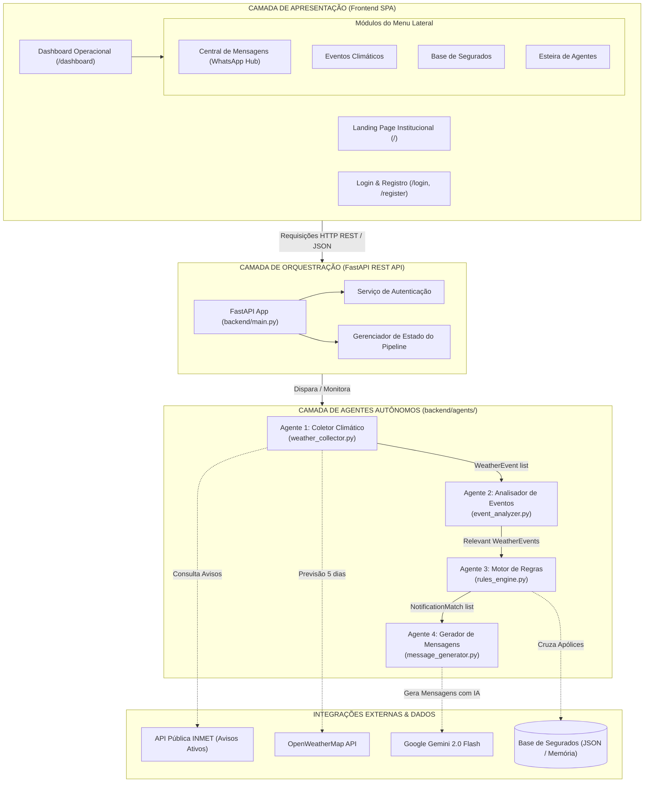

# InsureAlert — Comunicação Proativa com Segurados
### Desafio 5 — InsurMinds

---

## Integrantes

| Nome | E-mail | Telefone |
|---|---|---|
| Leonardo Pereira | ligueproleo@gmail.com | +55 11 98479-6122 |
| João Cardoso | jpscardoso@ufpa.br | +55 91 98273-6292 |

**Github:** https://github.com/jpscard/InsurMinds/tree/main/Desafio_5  
**Aplicação:** http://localhost:8000 *(executar localmente com `python -m uvicorn backend.main:app --host 127.0.0.1 --port 8000`)*

---

## 1. FRAMEWORK E STACK TECNOLÓGICA ESCOLHIDA

Para atender aos requisitos de monitoramento em tempo real, inteligência contextual e geração de mensagens personalizadas, a solução foi construída utilizando o ecossistema Python moderno para APIs assíncronas e IA generativa:

| Componente | Tecnologia / Versão | Justificativa e Papel na Solução |
|---|---|---|
| Framework Web / API | **FastAPI** (≥ 0.100.0) | Framework assíncrono de alta performance para expor os endpoints REST e servir o frontend estático com mínima latência. |
| Servidor ASGI | **Uvicorn** (≥ 0.23.0) | Servidor de produção compatível com ASGI, suportando operações `async/await` exigidas pelo pipeline de 4 agentes. |
| Modelo de Linguagem (LLM) | **Google Gemini 2.0 Flash** | Modelo com alta velocidade de resposta, ampla janela de contexto e custo reduzido, ideal para geração de mensagens personalizadas em lote para múltiplos segurados. |
| Orquestração dos Agentes | **Python puro (OOP)** | Pipeline sequencial de 4 agentes especializados implementados como classes Python, com passagem de dados tipados entre etapas. |
| Validação de Dados | **Pydantic** (≥ 2.0.0) | Modelagem e validação declarativa de todos os modelos de domínio (WeatherEvent, Policyholder, Notification, PipelineResult). |
| Cliente HTTP Assíncrono | **HTTPX** (≥ 0.24.0) | Consultas assíncronas às APIs externas (INMET, OpenWeatherMap) com suporte nativo a timeout e tratamento de erros HTTP. |
| Configuração de Ambiente | **python-dotenv** (≥ 1.0.0) | Carregamento seguro de API keys e variáveis sensíveis a partir de arquivo `.env`. |
| Interface de Usuário | **HTML5 / CSS3 / JavaScript** | Dashboard web interativo com menu lateral moderno, suporte a tema Claro/Escuro e layout WhatsApp Web, servido diretamente pelo FastAPI via `StaticFiles`. |

---

## 2. ARQUITETURA DA SOLUÇÃO

A solução foi concebida sob uma **arquitetura em camadas com esteira multi-agente**, garantindo desacoplamento estrutural, escalabilidade e separação nítida de responsabilidades:

- **Camada de Apresentação (`frontend/`):** Aplicação Single Page responsiva com arquitetura de Side Menu lateral corporativo. Inclui suporte nativo a Tema Escuro e Tema Claro com persistência local, central de disparos no formato WhatsApp Web e visualização em 4 formatos (WhatsApp, SMS 160 caracteres, E-mail corporativo e Push Notification).
- **Camada de Orquestração (`backend/main.py`):** Centraliza endpoints REST assíncronos, gerenciamento de autenticação, ciclo de vida do servidor ASGI e barramento de execução da esteira de agentes.
- **Camada de Agentes (`backend/agents/`):** 4 classes especializadas e autônomas, comunicando-se através de contratos de dados estritos via Pydantic.
- **Camada de Modelos (`backend/models/`):** Entidades canônicas tipadas (`WeatherEvent`, `Policyholder`, `Notification`, `PipelineResult`) compartilhadas transversalmente.
- **Camada de Dados (`backend/data/`):** Base de apólices e segurados em JSON enriquecido com geolocalização e canais prioritários.

---

## 3. DESCRIÇÃO DOS AGENTES DESENVOLVIDOS

A esteira de prevenção opera com **4 agentes autônomos sequenciais**:

---

### Agente 1 — Coletor de Dados Meteorológicos (`weather_collector.py`)

Operando na primeira etapa do pipeline, este agente consulta fontes meteorológicas oficiais externas e normaliza os dados no modelo canônico `WeatherEvent`.

- **Fonte primária:** API pública do INMET (`/avisos/ativos`), consultando os períodos de vigência `hoje` e `amanhã`.
- **Fonte secundária:** OpenWeatherMap API (previsão de 5 dias em intervalos de 3 horas).
- **Resiliência e Continuidade de Negócio:** Em caso de indisponibilidade de alertas do INMET no momento da consulta, gera automaticamente 3 alertas de demonstração realistas (Tempestade Severa no Sul/Sudeste, Chuva Intensa em MG/SP e Geada no Sul), assegurando operação ininterrupta.
- **Cliente HTTP:** HTTPX assíncrono com timeout de 30 segundos.
- **Saída:** `list[WeatherEvent]` — lista de eventos meteorológicos normalizados.

---

### Agente 2 — Analisador de Eventos Climáticos (`event_analyzer.py`)

Responsável pela triagem técnica, classificação taxonômica e cálculo de criticidade dos alertas coletados.

- **Classificação Taxonômica:** Identifica 7 categorias de fenômenos meteorológicos: Chuva Intensa, Granizo, Vento Forte, Tempestade, Onda de Calor, Geada e Raios.
- **Classificação por Severidade:** Mapeia faixas oficiais de risco do INMET (Perigo Potencial → MÉDIA, Perigo → ALTA, Grande Perigo → CRÍTICA).
- **Filtro de Relevância:** Descarta eventos de severidade BAIXA sem potencial de dano material, mantendo eventos de Granizo e Tempestade como prioritários independentemente do volume.
- **Saída:** `list[WeatherEvent]` — apenas eventos com relevância atuarial e potencial de sinistro.

---

### Agente 3 — Motor de Regras de Negócio (`rules_engine.py`)

Coração analítico do sistema, responsável pelo cruzamento matricial entre fenômenos climáticos e a carteira de segurados.

- **Cruzamento Geoespacial e Coberturas:** Para cada evento relevante, verifica segurados ativos localizados nas regiões afetadas e portadores de apólices suscetíveis (Automóvel, Residencial, Empresarial, Vida, Agro).
- **Matriz de Suscetibilidade:** Regras atuariais definem que Granizo afeta Automóvel, Residencial e Agro; Chuva Intensa atinge Residencial e Empresarial; Geada afeta coberturas de Agro.
- **Scoring de Prioridade:** Calcula pontuação combinada (Severidade + Impacto do Fenômeno + Risco da Apólice), ordenando a fila de disparos.
- **Deduplicação de Contatos:** Garante que o mesmo segurado não receba alertas redundantes para o mesmo evento no ciclo.
- **Saída:** `list[NotificationMatch]` — lista priorizada de correspondências segurado × evento.

---

### Agente 4 — Gerador de Mensagens Personalizadas (`message_generator.py`)

Agente de comunicação responsável pela síntese de mensagens contextualizadas, empáticas e acionáveis.

- **Geração por Inteligência Artificial:** Integração direta com o modelo **Google Gemini 2.0 Flash** através de engenharia de prompt estruturada. Produz: Assunto, Mensagem Longa, SMS curto (≤ 160 caracteres) e Lista de Ações Preventivas Recomendadas.
- **Diretriz Formal Corporativa (Zero Emojis):** Instrução mandatória no prompt e nos templates para que nenhuma comunicação utilize emojis, garantindo padrão profissional institucional de alta credibilidade.
- **Templates de Contingência:** 6 templates corporativos parametrizados ativados caso a API externa de LLM esteja inacessível.
- **Suporte Multicanal:** Geração adaptada para WhatsApp, SMS, E-mail e Push Notification.
- **Saída:** `list[Notification]` — comunicações completas com status `ENVIADA` prontas para visualização operacional.

---

## 4. FLUXOGRAMA DE FUNCIONAMENTO DA APLICAÇÃO

O fluxo completo de ponta a ponta é demonstrado no diagrama procedural abaixo:

```mermaid
flowchart TD
    Start(["Início: Operador aciona 'Executar Pipeline'"]) --> Req["POST /api/pipeline/run"]
    
    subgraph Etapa1["Etapa 1: Coleta de Dados Meteorológicos (Agente 1)"]
        Req --> FetchINMET{"Consulta API INMET<br/>/avisos/ativos?"}
        FetchINMET -->|Sucesso| ParseAlerts["Parseia Avisos Ativos (Hoje / Amanhã)"]
        FetchINMET -->|Indisponível / Sem Alertas| DemoEvents["Gera 3 Eventos Realistas de Contingência<br/>(Tempestade, Chuva Intensa, Geada)"]
        ParseAlerts --> NormEvents["Normaliza para modelos WeatherEvent"]
        DemoEvents --> NormEvents
    end

    subgraph Etapa2["Etapa 2: Análise & Severidade (Agente 2)"]
        NormEvents --> ClassifyType["Identifica Tipo: Chuva, Granizo, Tempestade, Geada"]
        ClassifyType --> ClassifySev["Mapeia Severidade: Baixa, Média, Alta, Crítica"]
        ClassifySev --> FilterRelev{"Severidade >= Média<br/>OU Granizo/Tempestade?"}
        FilterRelev -->|Não| Discard["Descarta evento de baixo risco"]
        FilterRelev -->|Sim| RelevantEvents["Emite lista de Eventos Relevantes"]
    end

    subgraph Etapa3["Etapa 3: Regras & Cruzamento Atuarial (Agente 3)"]
        RelevantEvents --> LoadPolicyholders["Carrega Carteira de Segurados Ativos"]
        LoadPolicyholders --> GeoMatch{"Segurado na área<br/>geográfica afetada?"}
        GeoMatch -->|Não| SkipPh["Ignora segurado para este alerta"]
        GeoMatch -->|Sim| PolicyMatch{"Apólice coberta<br/>pelo tipo de evento?"}
        PolicyMatch -->|Não| SkipPh
        PolicyMatch -->|Sim| CalcScore["Calcula Score de Prioridade Atuarial"]
        CalcScore --> Dedup["Deduplica matches (ID_Segurado + ID_Evento)"]
        Dedup --> MatchList["Ordena lista de NotificationMatch por criticidade"]
    end

    subgraph Etapa4["Etapa 4: Geração de Mensagens com IA (Agente 4)"]
        MatchList --> CheckGemini{"Google Gemini 2.0<br/>disponível?"}
        CheckGemini -->|Sim| PromptAI["Gera mensagem personalizada via Prompt:<br/>Assunto, Mensagem Empática, SMS 160 chars, Checklist"]
        CheckGemini -->|Não| FallbackTpl["Aplica template corporativo parametrizado (Fallback)"]
        PromptAI --> SelectChannel["Identifica canal preferido: WhatsApp, SMS, E-mail, Push"]
        FallbackTpl --> SelectChannel
        SelectChannel --> DispatchSim["Simula entrega com status ENVIADA e carimbo de data/hora"]
    end

    DispatchSim --> ResultState["Registra resultado no estado global do servidor"]
    ResultState --> EndNode(["Dashboard atualiza KPIs, Central de Mensagens e Logs em tempo real"])
```

---

## 5. CONSULTAS / DEMONSTRAÇÕES REALIZADAS

Abaixo são detalhadas 5 situações reais demonstradas pelo sistema, ilustrando o raciocínio de cada agente e a estrutura dos resultados gerados:

---

### Demonstração 1 — Pipeline com Alertas Reais do INMET

**Situação:** Execução do pipeline em dia com alertas meteorológicos oficiais ativos publicados pelo INMET.

**Raciocínio do Agente Coletor:** Realiza GET em `https://apiprevmet3.inmet.gov.br/avisos/ativos`, itera pelos períodos `hoje` e `amanhã`, parseia os campos de estados afetados, municípios, severidade e instruções, normalizando todos os registros em objetos `WeatherEvent`.

| Métrica | Valor |
|---|---|
| Eventos brutos coletados | Dinâmico (conforme alertas oficiais ativos) |
| Eventos relevantes identificados | Filtrados por severidade MÉDIA ou superior |
| Segurados a notificar | Cruzamento por geolocalização e apólice ativa |
| Notificações geradas | 1 por par segurado × evento × apólice |

---

### Demonstração 2 — Pipeline em Modo de Demonstração e Contingência

**Situação:** Execução quando o INMET não possui alertas críticos ativos no momento.

**Raciocínio do Agente Coletor:** Detecta resposta vazia da API oficial e ativa `generate_demo_events()`, simulando 3 eventos críticos representativos da geografia brasileira:

| Evento Climático | Severidade | Estados Afetados | Municípios de Referência |
|---|---|---|---|
| Tempestade | MÉDIA (Perigo Potencial) | PR, SC, RS, SP | Curitiba, Florianópolis, Porto Alegre, São Paulo e outros 15 municípios |
| Chuva Intensa | ALTA (Perigo) | MG, SP | Belo Horizonte, São Paulo, Guarulhos, Campinas, Sorocaba |
| Geada | MÉDIA (Perigo Potencial) | PR, SC, RS | Guarapuava, Ponta Grossa, Curitiba, Caxias do Sul, Chapecó |

---

### Demonstração 3 — Raciocínio de Priorização do Motor de Regras

**Situação:** Cruzamento dos 3 eventos climáticos com a base de 20 segurados, gerando 47 disparos preventivos qualificados.

**Raciocínio do Agente de Regras:** Para cada evento, verifica quais tipos de seguro sofrem risco material. Para cada segurado ativo, checa localização e apólices vigentes. O motor calcula a prioridade atuarial e elimina contatos redundantes.

| Prioridade | Segurado | Município/UF | Tipo de Apólice | Score de Risco |
|---|---|---|---|---|
| 1 | Maria Silva | Curitiba/PR | Automóvel | 80 pontos (Crítico) |
| 2 | Carlos Pereira | Porto Alegre/RS | Automóvel | 80 pontos (Crítico) |
| 3 | Luciana Mendes | Blumenau/SC | Residencial | 70 pontos (Alto) |
| 4 | Ana Oliveira | São Paulo/SP | Residencial | 70 pontos (Alto) |
| 5 | Fernanda Costa | Londrina/PR | Agro | 70 pontos (Alto) |

---

### Demonstração 4 — Mensagem Personalizada Gerada com IA (Google Gemini)

**Situação:** Geração automatizada de alerta preventivo para Maria Silva (Curitiba/PR, apólices de Seguro Residencial e Automóvel) sob risco iminente de tempestade com granizo.

**Resultado Gerado pelo Agente Comunicador (Padrão Corporativo sem Emojis):**

> **Assunto:** Alerta: Tempestade em Curitiba — Proteja seu Lar e Veículo
>
> Prezada Maria,
>
> O Instituto Nacional de Meteorologia (INMET) emitiu um alerta de tempestade com risco de granizo para a região de Curitiba/PR. Como titular de apólices de seguro Residencial e Automóvel, recomendamos ações preventivas imediatas:
>
> • Estacione seu veículo em garagem ou local coberto
> • Recolha objetos soltos em áreas externas (vasos, móveis, tendas)
> • Feche janelas e portas com segurança
> • Desligue aparelhos eletrônicos da tomada
> • Em caso de emergência, acione a Defesa Civil (199) ou Bombeiros (193)
>
> **SMS:** Alerta Curitiba: Tempestade c/ granizo. Proteja veículo em local coberto. Recolha objetos externos. Defesa Civil: 199

---

### Demonstração 5 — Contingência por Templates Dinâmicos

**Situação:** Execução em modo de contingência sem chave de IA configurada. O sistema seleciona o template institucional de Geada para a Fazenda São José Agrícola (Guarapuava/PR, seguro agro).

**Resultado Gerado:**

> **Assunto:** Alerta: Geada — Proteja suas plantações
>
> Prezado(a) Fazenda,
>
> Há risco de geada na região de Guarapuava/PR.
>
> Recomendações para seu seguro agrícola:
> • Proteja plantações sensíveis ao frio
> • Verifique sistemas de aquecimento
> • Proteja tubulações expostas contra congelamento
> • Mantenha animais em abrigos adequados
>
> **SMS:** Alerta: Geada prevista em Guarapuava. Proteja plantações e tubulações. Verifique aquecimento.

---

## 6. DEMONSTRAÇÃO VISUAL DAS TELAS DA APLICAÇÃO

Todas as telas do sistema foram modernizadas para um padrão estético de alto nível, com layout corporativo, ausência total de emojis e suporte completo a temas:

---

### 6.1 Tela de Login Corporativo Centralizada

A tela de autenticação foi redesenhada com card centralizado, logotipo oficial em alta definição, alternador de tema Claro/Escuro e bloco de demonstração com preenchimento em 1 clique:

| Modo Escuro (Dark Mode) | Modo Claro (Light Mode) |
| :---: | :---: |
|  |  |

---

### 6.2 Central de Mensagens Multicanal (Layout WhatsApp Web com Side Menu)

O painel principal adota a experiência consolidada do WhatsApp Web com menu lateral fixo (`.app-sidebar`), listagem de segurados à esquerda com avatar tipográfico e prévia com confirmação de entrega (`✓✓`), e canvas principal de conversa com badges de criticidade, checklist de prevenção e botões de ação rápida:

---

### 6.3 Suporte a Tema Claro Corporativo

O sistema oferece transição suave entre Modo Escuro e Modo Claro com paleta de cores calibrada para máxima legibilidade e conforto visual em ambientes corporativos:

---

### 6.4 Visualização Multicanal e Mockup de E-mail

O operador pode alternar em tempo real entre 4 canais de comunicação (WhatsApp, SMS com medidor de 160 caracteres, E-mail corporativo e Push Notification):

---

### 6.5 Módulos de Gestão Operacional do Menu Lateral

Navegação fluida sem recarregamento de página entre os módulos centrais da seguradora:

#### Monitoramento de Eventos Climáticos (INMET)
Exibe alertas meteorológicos ativos e de demonstração categorizados por criticidade (Baixa, Média, Alta, Crítica) com identificação de fontes oficiais e estados impactados:

#### Base de Segurados e Carteira de Clientes
Tabela completa com busca instantânea, filtragem por cidade/estado/apólice e canal prioritário:

#### Esteira dos 4 Agentes Autônomos
Painel de monitoramento da esteira com status em tempo real de cada etapa, tempos de processamento e métricas de execução:

---

*Relatório técnico consolidado do sistema InsureAlert — Desafio 5 — InsurMinds.*
