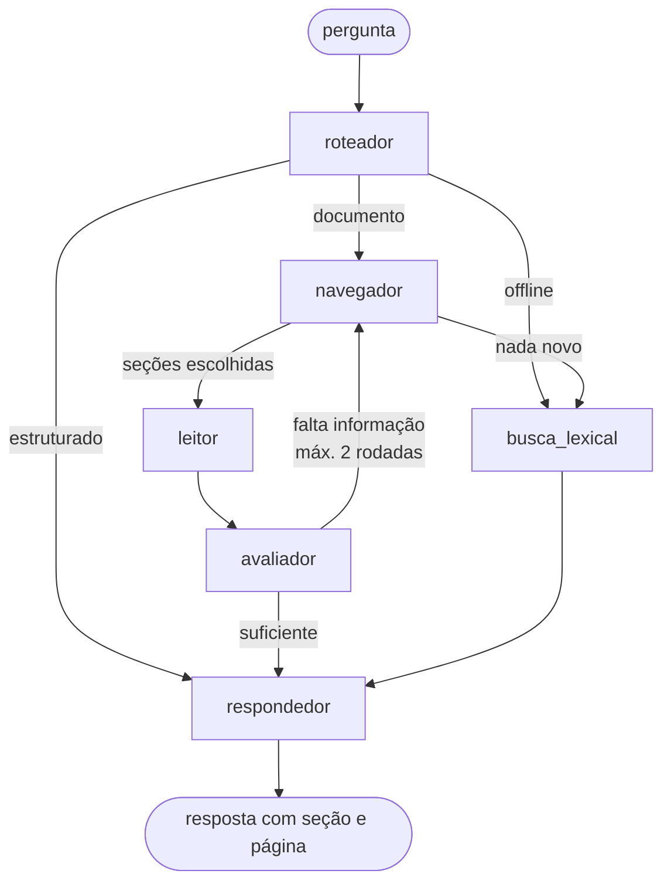

# Arquitetura da solução

Plataforma para **extrair, estruturar, armazenar, consultar e comparar apólices de seguro D&O**
(Responsabilidade Civil de Administradores e Diretores), usando OCR e IA generativa.

## Visão geral do fluxo

```
 ┌──────────────┐   ┌────────────────┐   ┌──────────┐   ┌──────────┐   ┌───────────┐   ┌──────────────┐
 │ 1. Recebimento│──▶│ 2. Ingestão/OCR │──▶│ Triagem  │──▶│ Extração │──▶│ Validação │──▶│ 4. SQLite     │
 │ PDF / imagem  │   │ pdfplumber +   │   │ (LLM)    │   │ (LLM)    │   │ (regras)  │   │ relacional + │
 └──────────────┘   │ Tesseract      │   └──────────┘   └──────────┘   └───────────┘   │ JSON + texto │
                    └────────────────┘                  3. Organização               └──────┬───────┘
                                                                                             │
                             ┌───────────────────────────────────────────────┬───────────────┤
                             ▼                                               ▼               ▼
                   ┌───────────────────┐                        ┌───────────────────┐  ┌──────────────┐
                   │ 5. Consulta       │                        │ 6. Comparação      │  │ SQL somente  │
                   │ LangGraph+índice  │                        │ diff determinístico│  │ leitura      │
                   └─────────┬─────────┘                        │ + análise via LLM  │  └──────┬───────┘
                             │                                  └─────────┬─────────┘         │
                             └──────────────────────┬─────────────────────┴───────────────────┘
                                                    ▼
                                   ┌─────────────────────────────────┐
                                   │ 7. Apresentação (Web/API/CLI)   │
                                   │ tabelas, destaques, xlsx, .md   │
                                   └─────────────────────────────────┘
```

O `Pipeline` (`do_platform/pipeline.py`) orquestra os agentes. Interface web e linha de
comando usam apenas o `Pipeline`, nunca os agentes diretamente.

## Componentes

| Módulo | Responsabilidade |
|---|---|
| `config.py` | Configuração via variáveis de ambiente / `.env` (nenhuma credencial no código). |
| `schema.py` | Modelo canônico `ApoliceDO` (Pydantic): contrato entre os agentes. |
| `llm/` | Interface `LLMProvider` + implementações Anthropic, OpenAI, Gemini e Offline. Retentativas com backoff e parser de JSON tolerante. |
| `ingestion/` | Leitura de PDF e imagem; decide página a página entre texto nativo e OCR. |
| `agents/` | Agentes especializados (abaixo) e seus prompts (`prompts.py`). |
| `indexing.py` | Índice hierárquico de cada documento (abordagem PageIndex): árvore de seções detectada pelo layout. |
| `comparison/` | Comparação determinística: alinhamento de coberturas/exclusões e cálculo das diferenças. |
| `storage/` | Repositório SQLite. |
| `api/main.py` + `web/` | API REST (FastAPI) e interface web servida por ela. O provedor, o modelo e a chave de LLM chegam em cabeçalhos a cada requisição; o servidor não guarda a chave. |
| `app.py` / `cli.py` | Interface Streamlit (legada) e linha de comando. |

## Agentes

| Agente | Usa LLM? | Entrada → Saída | Por quê |
|---|---|---|---|
| **Triagem** | Sim (fallback por regras) | início do texto → `{eh_do, tipo_documento, seguradora, confianca}` | Evita processar documentos errados e sinaliza se é apólice, condições gerais, proposta etc. Usa só ~6 mil caracteres para ser barato. |
| **Extração** | Sim | texto completo → `ApoliceDO` | Núcleo da solução. Lê linguagem jurídica heterogênea e produz JSON no esquema. Classifica coberturas em Lado A/B/C. Cita `trecho_fonte` para rastreabilidade. |
| **Validação** | Não | `ApoliceDO` → `ApoliceDO` normalizado + alertas | Revisor determinístico: normaliza datas e valores, detecta sublimite > LMG, vigência invertida, campos ausentes. Não "corrige" silenciosamente; alerta o usuário. |
| **Comparação** | Sim (sobre fatos já calculados) | N apólices → tabelas de diferenças + análise executiva | Diferenças objetivas calculadas por código; o LLM interpreta impacto e aponta qual apólice é mais favorável em cada tema. |
| **Indexação** | Só nos resumos | páginas → árvore de seções | Monta o sumário do documento que a Consulta navega. A estrutura vem do layout (títulos em maiúsculas, cláusulas numeradas); o LLM só resume as seções. |
| **Consulta** | Sim (fallback BM25) | pergunta + apólices → resposta com citação de seção e página | Grafo LangGraph que roteia a pergunta, navega o índice, lê as seções e responde (detalhes abaixo). |

### Consulta: RAG por raciocínio sobre o índice (PageIndex + LangGraph)

Apólices são contratos longos e estruturados, em que a resposta depende de achar a cláusula certa e
ler o contexto dela (exceções, remissões). Em vez de picotar o texto em pedaços e buscar por
similaridade, a consulta segue a abordagem **PageIndex** (VectifyAI): cada documento vira uma árvore de
seções com resumos, e o LLM **navega o sumário** para decidir o que ler, como um especialista folheando
a apólice. A orquestração é um grafo **LangGraph** (`agents/qa.py`), no mesmo padrão supervisor +
arestas condicionais usado no SeguraBot:



| Nó | O que faz |
|---|---|
| `roteador` | Decide se os dados estruturados bastam ("qual tem o maior LMG?") ou se é preciso ler o documento ("a exclusão X tem exceções?"). |
| `navegador` | Recebe o sumário de cada apólice (id, título, páginas, resumo, sem o texto) e escolhe até 6 seções, com o motivo. Ids inexistentes ou repetidos são descartados. |
| `leitor` | Traz o texto das seções escolhidas, incluindo as subseções. |
| `avaliador` | Verifica se o que foi lido basta; se não, devolve o que falta e o grafo navega de novo (no máximo 2 rodadas). |
| `busca_lexical` | BM25 sobre as seções: caminho do modo offline e reserva quando a navegação falha. |
| `respondedor` | Responde só com os dados estruturados e as seções lidas, citando apólice, seção e página. |

Cada nó registra o que fez; a interface mostra esse **caminho da consulta** junto da resposta. Os nós
chamam a camada `LLMProvider` do projeto (não os modelos do LangChain), então a consulta continua
funcionando com Anthropic, OpenAI ou Gemini. A biblioteca oficial do PageIndex não foi usada porque a
versão open source só aceita OpenAI.

### Detalhes do Agente de Extração
- **Documentos longos**: o texto é dividido em blocos de páginas inteiras (`CHUNK_CHARS`); cada bloco
  é extraído e os parciais são consolidados (1º valor não nulo para campos simples, união sem
  duplicatas para listas). Estratégia *map-reduce*.
- **Robustez do JSON**: (1) pedido de saída JSON nativo quando o provedor suporta; (2) parser que
  tolera cercas \`\`\` e texto em volta; (3) se o JSON não seguir o esquema Pydantic, os erros de
  validação são devolvidos ao modelo para autocorreção.
- **Temperatura 0** para maximizar reprodutibilidade.

## Decisões de arquitetura e justificativas

1. **Comparação híbrida (código + LLM).** Números e presença/ausência de cláusulas são calculados
   de forma determinística; o LLM só interpreta. Assim valores monetários nunca são "alucinados" na
   comparação e o resultado é reprodutível. O LLM agrega o que código não faz bem: avaliar impacto e
   redigir a recomendação.
2. **Esquema canônico com Pydantic.** Um contrato explícito entre agentes permite validar a saída do
   LLM, gerar o JSON Schema enviado no prompt e evoluir campos em um só lugar.
3. **Provedor de LLM plugável.** A interface `LLMProvider` isola os SDKs. Trocar Anthropic por OpenAI
   ou Gemini é uma linha no `.env`. O modo `offline` permite demonstrar e testar sem chave.
4. **OCR seletivo por página.** PDFs digitais usam o texto nativo (rápido e exato); só páginas sem texto
   vão para o Tesseract. PSM 6 preserva linhas de tabelas, comuns nos quadros de coberturas.
   Alternativa considerada: enviar imagens a um LLM multimodal. Foi descartada como padrão por custo,
   mas é uma evolução natural (ver abaixo).
5. **SQLite com modelo híbrido.** Colunas relacionais para o que se filtra (seguradora, LMG, prêmio),
   tabelas filhas para coberturas/exclusões (permitem SQL como "quem cobre Lado C?") e o JSON
   completo para não perder detalhe nem exigir migração a cada campo novo. Zero infraestrutura para
   rodar a demo.
6. **Deduplicação por hash (SHA-256).** Reenviar o mesmo arquivo não gasta chamadas ao LLM.
7. **Revisão humana.** A interface permite editar o JSON extraído; a correção substitui a extração.
8. **Tratamento de erros em camadas.** Erros de configuração (`LLMError`) param cedo com mensagem clara;
   falhas transitórias têm retentativa com backoff; triagem e análise comparativa têm fallback por
   regras para não bloquear o fluxo; cada arquivo em lote é processado de forma independente.

## Modelo de dados (SQLite)

- `apolices`: identificação, vigência, LMG, prêmio, provedor usado, triagem, alertas, `dados_json`.
- `coberturas`: nome, categoria (Lado A/B/C, Custos de Defesa, Extensão...), limite, franquia.
- `exclusoes`: título, categoria, descrição.
- `paginas`: texto original por página e método (texto/OCR), base para a consulta.
- `comparacoes`: histórico das análises geradas.
- `indices`: árvore de seções de cada documento (JSON), navegada pela Consulta. Apólices processadas
  antes da indexação ganham um índice por estrutura na primeira consulta.

## Limitações conhecidas

- **Condições gerais separadas**: muitas exclusões estão nas Condições Gerais, não na apólice; se só a
  apólice for enviada, a comparação de exclusões fica incompleta (o Validador avisa).
- **Alinhamento por similaridade de palavras**: coberturas com nomes muito diferentes para o mesmo
  conceito podem não ser pareadas. Embeddings ou um passo de normalização via LLM resolveriam.
- **OCR** depende da qualidade da digitalização; tabelas complexas podem perder a estrutura.
- **Índice depende do layout**: documentos sem títulos nem cláusulas numeradas viram uma seção por
  página; a navegação ainda funciona, mas com menos precisão.
- **Consulta com IA faz até 5 chamadas ao LLM** (roteador, navegador, avaliador, navegador, resposta):
  mais precisa, porém mais lenta e cara que uma busca direta.
- **Busca por palavras (offline e reserva)** usa BM25: sinônimos não são capturados.
- **Sem avaliação quantitativa** contra um conjunto rotulado de apólices reais.
- As apólices de exemplo são **fictícias**; os resultados com apólices reais variam.
- A análise gerada não substitui parecer de corretor ou advogado especializado.

## Evolução futura

- LLM multimodal para páginas digitalizadas ou tabelas difíceis (enviar a imagem da página).
- Embeddings para o alinhamento semântico de coberturas e cláusulas entre seguradoras.
- Memória de conversa no grafo de consulta (perguntas de acompanhamento, como "e na Boreal?").
- Taxonomia padronizada de coberturas/exclusões D&O para comparação mais precisa entre seguradoras.
- Conjunto de avaliação rotulado (precisão/recall por campo) e testes de regressão dos prompts.
- Orquestração com fila (Celery/RQ) para lotes grandes; PostgreSQL em produção.
- Autenticação, trilha de auditoria e controle de acesso por cliente.
- Geração automática de relatório comparativo em PDF.

## Referências

- VectifyAI. PageIndex: vectorless, reasoning-based RAG. https://github.com/VectifyAI/PageIndex
- LangChain. LangGraph. https://github.com/langchain-ai/langgraph

- SUSEP. Circular SUSEP nº 637, de 27 de julho de 2021 — seguros do grupo Responsabilidades, incluindo
  RC D&O. https://www.legisweb.com.br/legislacao/?id=417827
- SUSEP. Seguro de Responsabilidade (portal gov.br).
  https://www.gov.br/susep/pt-br/copy_of_planos-e-produtos/seguros/seguro-de-responsabilidade
- Documentos de exemplo: gerados por `scripts/gerar_amostras.py`; seguradoras, tomadores e números são
  fictícios, com estrutura inspirada em apólices D&O típicas do mercado brasileiro.
